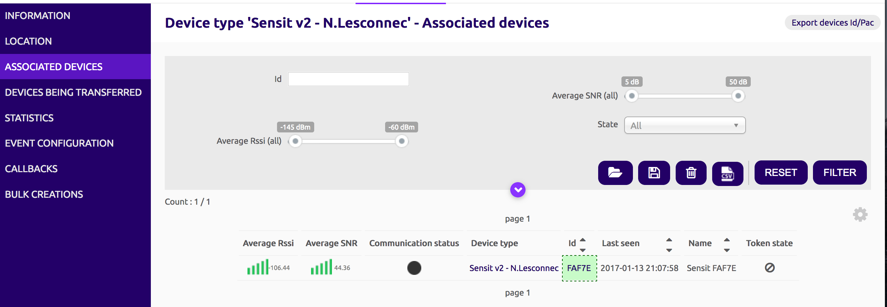
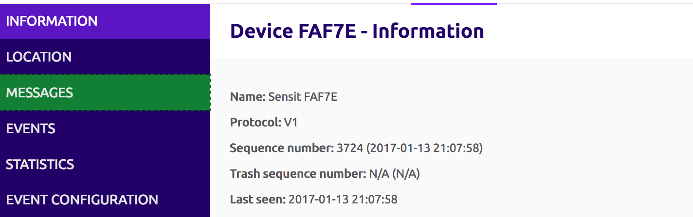
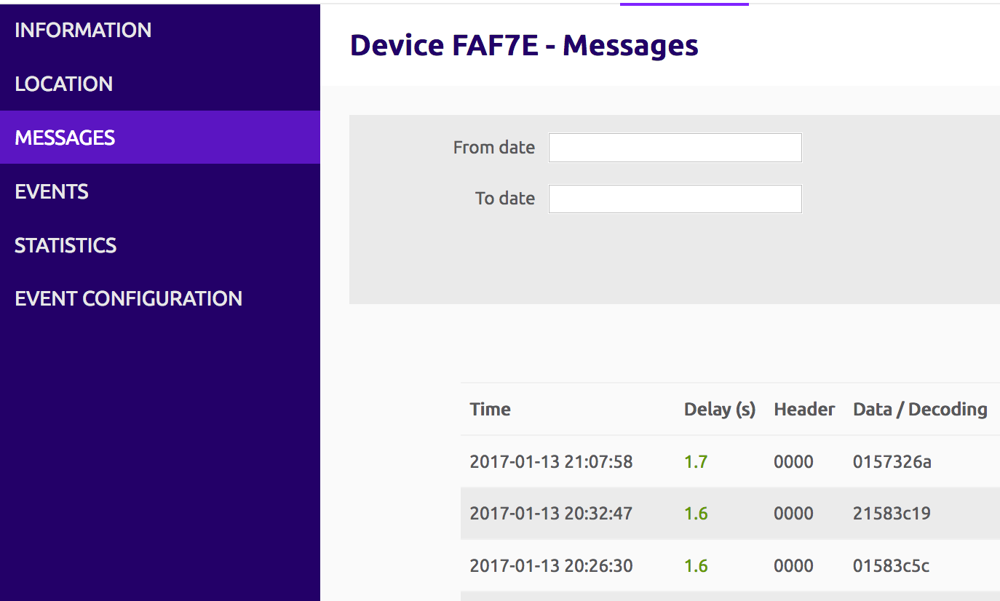

# Bosch Connected Experience 2017 - Useful resources

## Sigfox basics

* [Developer Portal](http://makers.sigfox.com)
* [Youtube videos](http://youtube.com/sigfox)
* [Q&A Platform](http://ask.sigfox.com)
* [Github code samples](http://github.com/sigfox)
* [Network coverage : 32 countries and counting ;) ](http://sigfox.com/coverage)
* [BCX17 Intro slides](https://www.slideshare.net/nicolsc-slides/bcx17-sigfox-intro)

## Sensit

### Register

You need the unique `ID` of the device (printed on the back), and its `PAC`(provided 1 to 1)

Head out to the [Sigfox backend](https://backend.sigfox.com/activate/sensit) and fill in the form.  
(If you already have a Sigfox account, log in first)

You will receive an automated email asking you to setup your password and confirm your account

You're good to go!

---
⚠ It may take up to one hour to attach the device to your account, in case it was previously attached to a demo account.
> Good things come to those who wait 😉 

### First message

Double-press the Sensit button.  
The LED should blink for ~6 seconds, while its sending a first message

### First steps on Sigfox backend

Log-in to your [Sigfox account](http://backend.sigfox.com), and then access the `DEVICE TYPE` menu, then click on the name of the newly created device type. It should be called `Sensit EVK`

#### Access your device

Enter the `Associated Devices` menu, and click on the ID of the only one listed.

### Check messages

Your incoming messages will appear here, listing the time of reception, raw data payload & reception quality indicators.

### Push data to your server

[TBC]

### Parse the incoming data frame
[TBC]

---
⚠ To enforce the ETSI regulation on the 868MHz, the Sensit won't send more than 6 messages per hour (duty cycle).  
If you need to send more than that for testing purposed during the week end, [contact Nicolas](mailto:devrelations@sigfox.com) 

## NXP Development board

[TBC w/ Vivek]

## Using the Sigfox API

⚠ API should be used as a sync/backup mechanism.  
We recommend using the callbacks (push) as primary data access channel. No need to poll the API every second ;)

Extensive documentation of the Sigfox API available [here](./Sigfox-API.md) 

You'll also find the API documentation in the `Group` > `Api Access` menu.  
Once you set up a pair of API credentials (look for the `new` button on the top right), you'll have a link to the documentation matching the access rights you chose.

## Hono Platform

Mohammad Zubair (@Bosch SI) wrote a Sigfox adapter for the [Eclipse Hono](http://hono.bosch-iot-suite.com) platform.  
Read the documentation & step-by-step guide [here](./Sigfox-to-hono.md)